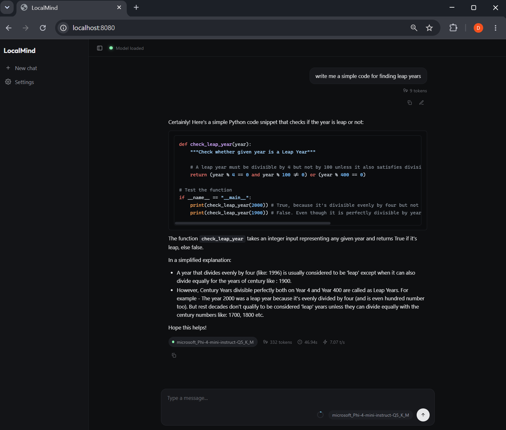

<div align="center">


# LocalMind

**Private, local LLM chat for GGUF models — your machine, your models, your data.**

  

<!-- Hero screenshot: capture the main chat view mid-conversation (sidebar expanded,
     a reply with a code block, per-message token stats, and the composer context ring),
     then save it as assets/screenshot.png so it renders here. -->


</div>

A private, local chat interface for running GGUF language models on your own machine. No cloud, no API keys, no data leaving your computer. Built with **FastAPI** + **llama-cpp-python** and a **llama.cpp-style** dark UI.

---

## Why This Exists

Most local LLM tools (Ollama, text-generation-webui, LM Studio) hide the model configuration behind abstractions. You get a chat box, but no direct control over how the model actually runs on your hardware. Worse — they use generic default settings that leave performance on the table. Your CPU's instruction sets, your RAM capacity, your GPU's VRAM — none of it is leveraged unless you dig through CLI flags or config files.

LocalMind gives you that control, without requiring you to be an expert. It **auto-detects your hardware** and applies platform-optimized inference settings out of the box — then lets you fine-tune every parameter visually if you want to. Flash attention, memory locking, NUMA-aware scheduling, KV-cache quantization, batch sizing — all exposed and tunable from a single settings panel.

---

## Features

- 🔒 **Fully local & private** — models run on your machine; nothing is sent anywhere.
- 🎛️ **Hardware auto-detection** — detects CPU, RAM, and GPU on startup and picks a platform-optimized profile, with every parameter still editable.
- 📊 **Live telemetry** — real per-message token counts, generation speed (tokens/sec), and a `used / n_ctx` context-usage meter, all from the model's real tokenizer.
- 🔍 **GGUF introspection** — reads model specs (parameters, size, training context, embedding & vocab size) straight from the file.
- 🧠 **Automatic context management** — sliding window by default, with optional rolling summarization for long chats.
- 💾 **Export conversations** — download the current chat as JSON, including per-turn stats.
- ✨ **Rich streaming** — markdown + syntax-highlighted code, rendered as it streams.

---

## Quick Start

### 1. Install dependencies

```bash
pip install -r requirements.txt
```

<details>
<summary><strong>Platform-specific notes for llama-cpp-python</strong></summary>

`llama-cpp-python` compiles C++ code during install and can be tricky to set up depending on your OS and hardware (CPU vs GPU). See **[INSTALL_LLAMA_CPP.md](./INSTALL_LLAMA_CPP.md)** for the full installation guide covering Windows, Linux, and macOS with both CPU and GPU builds.

</details>

### 2. Get a model

Download any GGUF-format model. Good starting points:

| Model | Size | RAM needed | Link |
|-------|------|-----------|------|
| **Gemma 3 4B IT Q4_K_M** | ~2.9 GB | 6 GB | [bartowski/gemma-3-4b-it-GGUF](https://huggingface.co/bartowski/google_gemma-3-4b-it-GGUF) |
| Mistral 7B Instruct Q4_K_M | ~4.4 GB | 8 GB | [TheBloke/Mistral-7B-Instruct-v0.2-GGUF](https://huggingface.co/TheBloke/Mistral-7B-Instruct-v0.2-GGUF) |
| Llama 3.1 8B Instruct Q4 | ~4.7 GB | 8 GB | [bartowski/Meta-Llama-3.1-8B-Instruct-GGUF](https://huggingface.co/bartowski/Meta-Llama-3.1-8B-Instruct-GGUF) |

> **Recommended:** Gemma 3 4B IT Q4_K_M — small enough to run comfortably on most machines, good instruction-following quality for its size.

### 3. Run

```bash
python server.py
```

Open [http://localhost:8080](http://localhost:8080)

> **Port already in use?** If a previous server is still running, the new one will fail to bind port 8080 (and you'll see stale data). Stop the old process first, or reuse it.

### 4. Load a model

1. Open **Settings** from the sidebar (or the gear).
2. Under **General → Model Configuration**, click **Pick Model** → browse to your `.gguf` file.
3. Adjust parameters if needed (context window, threads, GPU layers) — or accept the auto-detected hardware profile.
4. Click **Load Model**.
5. The connection dot turns green and the model pill shows the model name — start chatting.

---

## How It Works

```
Browser (localhost:8080)                 FastAPI Server (server.py)
┌───────────────────────────┐           ┌──────────────────────────────┐
│  Sidebar + Composer UI     │  fetch    │  /api/chat                   │
│  • Send / stop             │ ───────►  │  • Context management        │
│  • Stream + render markdown│ ◄───────  │  • Run inference             │
│  • End-of-answer stats     │  NDJSON   │  • Stream tokens + stats     │
│  • Context-usage ring      │           │                              │
│                            │           │  /api/browse                 │
│  Settings overlay          │ ───────►  │  • List dirs + .gguf         │
│  • General / Sampling /    │           │                              │
│    Export tabs             │ ───────►  │  /api/load-model             │
│  • Hardware profile        │           │  • Hot-swap + read specs     │
│  Model Info modal          │ ◄───────  │  /api/model-status           │
│  • GGUF specs + runtime    │           │  • state + GGUF specs        │
└───────────────────────────┘           └──────────────┬───────────────┘
                                                        │
                                                        ▼
                                         ┌──────────────────────────────┐
                                         │  llama-cpp-python             │
                                         │  • GGUF model in memory       │
                                         │  • CPU or GPU inference       │
                                         │  • tokenizer + model metadata │
                                         └──────────────────────────────┘
```

### Streaming & stats

Responses stream as newline-delimited JSON (`application/x-ndjson`). The front end renders markdown in real time with `marked.js` and highlights code with `highlight.js`. The stream ends with a `stats` object computed on the server:

- `user_tokens` — tokens in the last user message (real tokenizer)
- `completion_tokens` — tokens generated in the answer
- `elapsed_s` — wall-clock generation time
- `tokens_per_s` — throughput

The UI renders these under each message and accumulates them across the conversation to drive the context-usage ring.

### Model spec introspection

When a model loads, the server reads its intrinsic properties from the GGUF via llama-cpp-python (training context, parameter count, embedding size, vocab size) plus the on-disk file size, and exposes them through `/api/model-status`. Each read is guarded so a missing value degrades to "—" rather than breaking the card.

### System prompt handling

Many GGUF models are picky about the `system` role in chat messages. The server automatically merges system prompts into the first user message for maximum compatibility across model families (Llama, Mistral, Gemma, etc.).

### Hardware auto-detection

On startup, the server probes your system. CPU cores/brand/flags (AVX2, AVX-512, FMA, F16C) and RAM come from `psutil` + `py-cpuinfo`, with the stdlib as a safety net. GPU detection uses OS-native probes (`nvidia-smi` for NVIDIA, `system_profiler` for Apple Metal) since no Python library covers it. Results are cached and served via `/api/hardware-profile`; the UI uses them to auto-select an optimization profile and pre-fill hardware settings.

---

## Context Management

Local models have limited context windows. Without management, long conversations silently overflow. LocalMind trims automatically before every request.

**Sliding Window (default)** — oldest messages are dropped when the conversation exceeds 75% of the token budget.

**Summarize + Protect (opt-in)** — old messages are compressed into a rolling summary using the model itself; recent messages stay verbatim.

### Budget allocation

```
Total context window (n_ctx)
├── Response reserve (max_tokens)     → space for the model's answer
└── Input budget (the rest)
    ├── System prompt                 → ~1%
    ├── Summary (when enabled)        → 10% of input budget
    ├── Protected zone                → 30% of input budget (recent messages, verbatim)
    └── Headroom                      → ~59% (free space for new messages)
```

| n_ctx | Behavior |
|-------|----------|
| < 3000 | Sliding window only (summary toggle ignored) |
| ≥ 3000 | Sliding window when toggle OFF, summarize + protect when ON |

The protected zone is a **token budget** (30% of input budget), not a fixed message count — short exchanges keep more pairs, long exchanges keep fewer, always at least one. See [logic.md](./logic.md) for the full algorithm.

---

## Settings & Parameters

All configurable from the **Settings overlay** (General, Sampling, and Export tabs). Settings persist in `localStorage` and survive refreshes.

### Hardware Profile (Auto-Detected)

| Profile | Description |
|---------|-------------|
| 🪟 Windows (CPU) | ngl=0, threads=P-cores-1, flash=on, mlock=on, numa=on, batch=1024 |
| 🪟 Windows (NVIDIA GPU) | ngl=-1, same as above |
| 🐧 Linux (CPU) | Same as Windows CPU |
| 🐧 Linux (NVIDIA GPU) | ngl=-1, same as above |
| 🍏 macOS (Apple Silicon) | ngl=99, batch=512, mlock=on, no numa |
| 🍏 macOS (Intel) | ngl=0, batch=512, mlock=on, no numa |
| ⚙️ Custom | All fields editable — auto-selected when you change any field |

### Model / Hardware / Inference

| Parameter | Default | Range | Purpose |
|-----------|---------|-------|---------|
| **Model Path** | — | Any `.gguf` file | Model to load (via file browser) |
| **n_ctx** | 2048 | 128 – 32768 \* | Context window |
| **n_gpu_layers** | 0 (auto) | -1 – 999 | GPU layer offloading |
| **n_threads** | auto | 1 – 64 | CPU threads |
| **n_batch** | 1024 (512 Mac) | 32 – 4096 | Tokens per forward pass |
| **Flash Attention** | ON | ON/OFF | Fused attention kernel |
| **Memory Lock** | ON | ON/OFF | Lock model in RAM |
| **NUMA** | ON (Win/Linux) | ON/OFF | NUMA-aware scheduling |
| **KV Quantization** | Off | Off / q8_0 | Quantize KV-cache (~40% memory saved) |
| **Max Response Tokens** | 512 | 64 – 4096 \* | Response length cap |
| **Temperature** | 0.7 | 0.0 – 1.0 | Randomness |
| **Top P** | 0.9 | 0.05 – 1.0 | Nucleus sampling |
| **Top K** | 40 | 1 – 100 | Hard candidate limit |
| **Repeat Penalty** | 1.1 | 1.0 – 2.0 | Repetition control |
| **Summarize old context** | OFF | ON/OFF | Rolling summarization |
| **System Prompt** | "You are a helpful AI assistant." | Any text | Model behavior |

> **\*** These are limits set by the settings UI, not hard limits of the model or engine — the server passes whatever value it's given straight to llama-cpp-python.
>
> - **`n_ctx` (capped at 32768):** Many models are trained for far larger contexts (128k+), so the *model* would accept more. The cap is a safety rail because context memory grows fast — roughly +0.5–1 GB of RAM/VRAM per doubling — and large windows can crash or thrash typical machines. Raise it only if your model was trained for it *and* you have the memory to spare.
> - **Max Response Tokens (capped at 4096):** The model can generate more, but response tokens are *reserved out of the context budget* (`input budget = n_ctx − max_tokens`). 4096 is already a very long single answer (~3,000 words); capping it prevents one response from starving the conversation history.

---

## API Endpoints

| Method | Endpoint | Purpose |
|--------|----------|---------|
| `GET` | `/api/tags` | Connection health check |
| `GET` | `/api/browse?path=` | Browse filesystem for `.gguf` files |
| `GET` | `/api/hardware-profile` | Auto-detected hardware info + recommended settings |
| `POST` | `/api/load-model` | Load a model with given parameters |
| `GET` | `/api/model-status` | Current model state + GGUF specs |
| `POST` | `/api/chat` | Send messages, receive inference response + stats |
| `POST` | `/api/reset-context` | Clear the summary cache (used by **New chat**) |

<details>
<summary><strong>Example: POST /api/chat response (final chunk)</strong></summary>

```json
{"done": true, "stats": {"user_tokens": 18, "completion_tokens": 42, "elapsed_s": 6.2, "tokens_per_s": 6.82}}
```

</details>

<details>
<summary><strong>Example: GET /api/model-status</strong></summary>

```json
{
  "model_path": "C:/models/Meta-Llama-3.1-8B-Instruct-Q4_K_M.gguf",
  "n_ctx": 4096, "n_threads": 5, "n_gpu_layers": -1,
  "flash_attn": true, "use_mlock": true, "numa": true, "n_batch": 1024,
  "status": "loaded",
  "training_ctx": 131072, "n_params": 8030000000,
  "n_embd": 4096, "n_vocab": 128256, "file_size_bytes": 4920000000
}
```

</details>

---

## Project Structure

```
LocalMind/
├── server.py             # FastAPI backend — routing, model loading, chat, stats, specs
├── context_manager.py    # Context trimming + optional summarization
├── hardware_detector.py  # Cross-platform hardware detection
├── index.html            # Single-page UI: sidebar, composer, overlays, modals
├── app.js                # Frontend logic — streaming, stats, settings, model mgmt, UI
├── styles.css            # llama.cpp-style dark theme (design tokens)
├── assets/               # Logo and screenshots
├── requirements.txt      # Python dependencies (pinned)
└── README.md             # This file
```

---

## Troubleshooting

### Connection dot is amber / "No model loaded"
The server is up but no model is loaded. Open Settings → Pick Model → Load Model. The dot turns green once loaded.

### Model pill shows a stale name, or the info card shows old numbers
Hard-reload (Ctrl+F5). The pill and card read from `/api/model-status`; when no model is loaded they show "No model loaded" and "—".

### Server serves old data after edits / won't start
Port 8080 is likely held by a previous server instance. Stop the old process before starting a new one.

### Model spec rows show "—" even when loaded
Your `llama-cpp-python` version may not expose a particular metadata method, or the GGUF lacks that key. Other rows still populate.

### Responses empty or cut off
Increase **Max Response Tokens** in Settings → Sampling.

### Model forgets earlier conversation
Normal — the context manager drops old messages. Enable **Summarize old context**, or increase `n_ctx`.

### Server crashes on model load (GPU errors)
Set **GPU Layers** to `0` for CPU-only inference.

---

## Roadmap

- Conversation persistence (multi-chat history in the sidebar)
- Bundle `marked` / `highlight.js` locally for true offline use (currently CDN)

---

## Acknowledgments

LocalMind's **visual design is heavily inspired by the web UI bundled with [llama.cpp](https://github.com/ggml-org/llama.cpp)'s `llama-server`**. The layout, dark theme, composer, and settings patterns take strong cues from that interface; the HTML/CSS/JS here were written from scratch for this project rather than copied.

LocalMind is not affiliated with or endorsed by the llama.cpp project. llama.cpp is distributed under the MIT License; this project builds on [`llama-cpp-python`](https://github.com/abetlen/llama-cpp-python) for inference. Markdown rendering uses [marked](https://github.com/markedjs/marked) and syntax highlighting uses [highlight.js](https://github.com/highlightjs/highlight.js).

---

## License

Licensed under the [MIT License](./LICENSE) — free to use, modify, and distribute (including in closed-source projects), as long as the copyright notice is retained.
